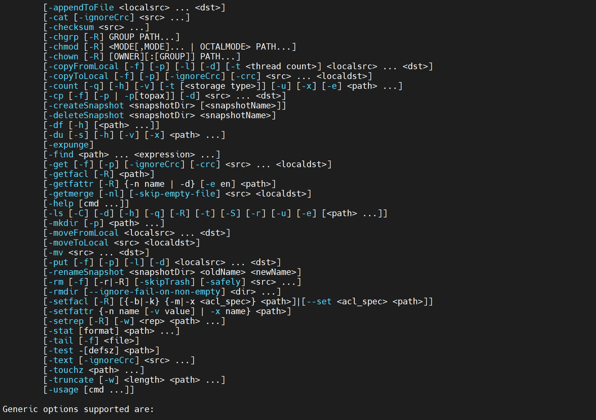
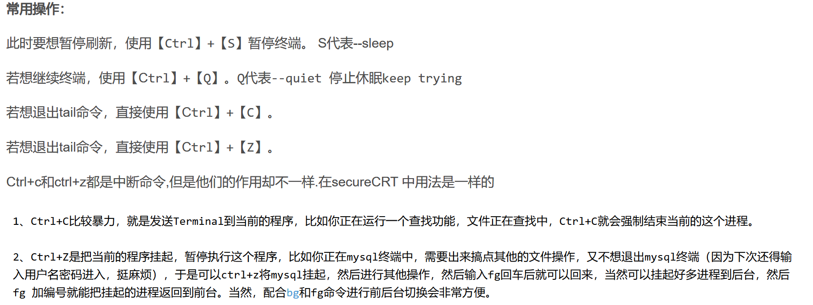

# 第3章 Hadoop分布式文件系统

## 3.0 产生的背景

​		随着数据量越来越大，一台独立的物理计算机逐渐已经存不下所有的数据。如何解决这一问题呢？直观的解决办法就是：当一台机器存不下时，那就用上百上千万台机器一起存储大规模的数据，但是管理和维护会极为不方便，十分低效。而这也是大数据时代必须解决的**海量数据的高效存储问题**！！

​		为此，**分布式文件系统**孕育而生！

​		**分布式文件系统是管理网络中跨多台计算机存储的文件系统**。该系统架构于网络之上，势必会引入了网络编程的复杂性，因此分布式文件系统比普通磁盘文件系统更为复杂。例如，如果使文件系统能够容忍节点故障的同时，不会丢失任何数据；在单一节点数据更新的同时告知整个文件系统进行同步更新，等等。

​		谷歌公司开发了**第一个大规模商业化应用的分布式文件系统GFS**，而Hadoop分布式文件系统是针对GFS的开源实现，它就是Hadoop两大核心组成部分之一**HDFS**！！由于其良好的容错能力，使得用户能在廉价服务器集群中存储大规模数据，实现大流量和大数据量的读写。

## 3.1 概述

### 3.1.1 分布式文件系统简介

> **块的概念：普通文件系统 VS 分布式文件系统!!**
>
> **普通文件系统**一般会把磁盘空间划分为每512字节一组，称为“磁盘块”，它是文件系统读写操作的最小单位，文件系统的块（Block）通常是磁盘块的整数倍，即每次读写的数据量必须是磁盘块大小的整数倍；
> **分布式文件系统**也采用了块的概念，文件被分成若干个块进行存储，块是数据读写的基本单元，只不过分布式文件系统的块要比普通文件系统中的块大很多，比如，HDFS默认的一个块的大小是64MB，而且与普通文件系统不同的是，在分布式文件系统中，如果一个文件小于一个数据块的大小，它并不占用整个数据块的存储空间。设计一个比较大的块，是为了**最小化寻址开销**；但是块的大小也不能太大，会由于MapReduce中的Map任务一次只处理一个块中的数据，如果启动的任务太少，反而会影响并行的苏速度。

​		分布式文件系统的设计一般采用**“客户机/服务器”（Client）**：客户端以特定的通信协议通过网络与服务器建立连接，提出文件访问请求，客户端和服务器可以通过设置访问权来限制请求方对底层数据存储块的访问。

​		分布式文件系统在**物理结构**上是由计算机集群中的多个节点构成的，如下图所示，这些节点分为两类：一类叫“**主节点**”（Master Node），或者也被称为“**名称节点**"（NameNode）；另一类叫“**从节点**"（Worker Node），或者也被称为“**数据节点**"（DataNode）：


- **名称节点**负责文件和目录的创建、删除和重命名等，同时管理着数据节点和文件块的映射关系，因此客户端只有访问名称节点才能找到请求的文件块所在的位置，进而到相应位置读取所需文件块；


- **数据节点**负责数据的存储和读取，在存储时，由名称节点分配存储位置，然后由客户端把数据直接写入相应数据节点，在读取时，客户端从名称节点获得数据节点和文件块的映射关系，然后就可以到相应位置访问文件块。数据节点也要根据名称节点的命令创建、删除数据块和冗余复制。

​		计算机集群中的节点可能发生故障，因此为了保证**数据的完整性**，分布式文件系统通常采用**多副本存储**。文件块会被复制为多个副本，存储在不同的节点上，而且存储同一文件块的不同副本的各个节点会分布在不同的机架上。

> 这样在单个节点出现故障时，就可以快速调用副本重启单个节点上的计算过程，而不用重启整个计算过程，整个机架出现故障时也不会丢失所有文件块。文件块的大小和副本个数通常可以由用户指定。

​		分布式文件系统是针对大规模数据存储而设计的，主要用于处理大规模文件，如TB级文件，处理过小的文件不仅无法充分发挥其优势，而且会严重影响到系统的扩展和性能。

### 3.1.2 HDFS简介

​		**HDFS（Hadoop Distribute File System）**是大数据领域一种非常可靠的存储系统，它以分布式方式存储超大数据量文件，但它并不适合存储大量的小数据量文件。同时HDFS是Hadoop和其他组件的数据存储层，运行在由价格廉价的商用机器组成的集群上的，而价格低廉的机器发生故障的几率比较高，因此HDFS在设计上采取了多种机制保证在硬件出错的环境中实现数据的完整性。总体而言，HDFS要实现以下目标。

- **兼容廉价的硬件设备**，实现在硬件出错的情况下也能实现数据的完整性
- **流数据读写**：不支持随机读写的操作
- **大数据集**（GB，TB以上的级别）
- **简单的文件模型**：一次写入、多次读取
- **强大的跨平台兼容性**：采用Java语言实现

局限性：

- **不适合低延迟数据访问**：HDFS主要是**面向大规模数据批量处理而设计**的，采用**流式数据读取**，具有**很高的数据吞吐率**，但是，这也意味着**较高的延迟**，因此，HDFS不适合用在需要较低延迟（如数十毫秒）的应用场合。对于低延迟要求的应用程序而言，HBase是一个更好的选择；
- **无法高效存储大量小文件**：小文件是指文件大小小于一个块的文件，HDFS无法高效存储和处理大量小文件，过多小文件会给系统扩展性和性能带来诸多问题：
  - ​	HDFS采用名称节点（NameNode）来管理文件系统的元数据，这些元数据被保存在内存中，从而使客户端可以快速获取文件实际存储位置，通常，每个文件、目录和块大约占150字节，如果有1000万个文件，每个文件对应一个块，那么，名称节点至少要消耗3GB的内存来保存这些元数据信息。很显然，这时元数据检索的效率就比较低了，需要花费较多的时间找到一个文件的实际存储位置。而且，如果继续扩展到数十亿个文件时，名称节点保存元数据所需要的内存空间就会大大增加，以现有的硬件水平，是无法在内存中保存如此大量的元数据的；
  - 用MapReduce处理大量小文件时，会产生过多的Map任务，线程管理开销会大大增加，因此处理大量小文件的速度远远低于处理同等大小的大文件的速度；
  - 访问大量小文件的速度远远低于访问几个大文件的速度，因为访问大量小文件，需要不断从一个数据节点跳到另一个数据节点，严重影响性能。

- **不支持多用户写入及任意修改文件**：HDFS只允许一个文件有一个写入者，不允许多个用户对同一个文件执行写操作，而且只允许对文件执行追加操作，不能执行随机写操作。

## 3.2 HDFS的体系结构

​		HDFS采用了主从（Master/Slave）结构模型，一个HDFS集群包括**一个名称节点（NameNode）**和**若干个数据节点（DataNode）**。

- **名称节点**作为中心服务器，负责管理文件系统的命名空间及客户端对文件的访问。
- **数据节点**负责处理文件系统客户端的读/写请求，在名称节点的统一调度下进行数据块的创建、删除和复制等操作。
- 每个数据节点会周期性地向名称节点发送**“心跳"信息**，报告自己的状态，没有按时发送心跳信息的数据节点会被标记为“宕机”，不会再给它分配任何I/O请求。

​		用户在使用HDFS时，仍然可以像在普通文件系统中那样，使用文件名去存储和访问文件。


​		实际上，在系统内部，一个文件会被切分成若干个数据块，这些数据块被分布存储到若干个数据节点上。当客户端需要访问一个文件时，首先把文件名发送给名称节点，名称节点根据文件名找到对应的数据块（一个文件可能包括多个数据块），再根据每个数据块信息找到实际存储各个数据块的数据节点的位置，并把数据节点位置发送给客户端，最后客户端直接访问这些数据节点获取数据。在整个访问过程中，名称节点并不参与数据的传输。这种设计方式，使得个文件的数据能够在不同的数据节点上实现并发访问，大大提高了数据访问速度。


## 3.3 HDFS的存储原理

### 3.3.1 数据的冗余存储

​		为了保证系统的**容错性**和**可用性**，HDFS 采用了**多副本方式**对数据进行冗余存储，通常***一个数据块的多个副本会被分布到不同的数据节点上***。


这种多副本方式具有以下 3 个优点：

- **加快数据传输速度**。当多个客户端需要同时访问同一个文件时，可以让各个客户端分别从不同的数据块副本中读取数据，这就大大加快了数据传输速度，实现了并行操作。
- **容易检查数据错误**。HDFS 的数据节点之间通过网络传输数据，采用多个副本可以很容易判断数据传输是否出错。
- **保证数据的可靠性**。即使某个数据节点出现故障失效，也不会造成数据丢失。

### 3.3.2 数据存取策略

数据存取策略包括 **数据存放** 、 **数据读取** 和 **数据复制** 等方面。

**1、数据存放**

HDFS 采用了以机架（Rack）为基础的数据存放策略。一个 HDFS 集群通常包含多个机架，不同机架之间的数据通信需要经过交换机或路由器，同一机架的不同机器之间数据通信不需要交换机或路由器，因此同一机架中不同机器之间的通信要比不同机架之间机器的通信带宽大。

HDFS 默认每个数据节点都是在不同机架上的，这样有一个缺点：**写入数据的时候不能充分利用同一机架内部机器之间的带宽**。这种方法同时也带来了更多显著的优点：

- 可以***获得很高的数据可靠性***，即使一个机架发生故障，位于其他机架上的数据副本仍然可用。
- 在读数据的时候，可以在多个机架上并行读取数据，大大***提高了数据读取速度***。
- 可以更容易***实现系统内部负载均衡和错误纠正***。

​		**HDFS 默认的冗余复制因子是 3**，每一个文件会被同时保存到 3 个地方，其中两份副本放在同一个机架的不同机器上面，第三个副本放在不同机架的机器上面。


HDFS 副本的存放策略是：

1）如果是在集群内发起写操作请求，则把第1个副本放置在发起写操作请求的数据节点上，实现就近写入数据。如果是来自集群外部的写操作，则从集群内部挑选一台磁盘空间较为充足、CPU不太忙的数据节点，作为第1个副本的存放地。
2）第2个副本会被放置在与第1个副本不同的机架的数据节点上。
3）第3个副本会被放置在与第1个副本相同的机架的其他节点上。
4）如果还有更多的副本，则继续从集群中随机选择数据节点进行存放。

**2、数据读取**

HDFS 提供了一个 API 可以确定一个数据节点所属的机架的 ID，客户端可以调用 API 获取自己所属机架的 ID。

当客户端读取数据时，从名称节点获取数据块不同副本的存放位置的列表，列表中包含了副本所在的数据节点，可以调用 API 开确定客户端和这些数据节点所属的机架 ID。当发现某个数据块副本对应的机架 ID 和客户端对应的机架的 ID 相同时，就优先选择该副本读取数据，如果没有发现，就随机选择一个副本读取数据。

**3、数据复制**

HDFS 的数据复制采用了 **流水线复制** 的策略，大大提高了数据复制过程的效率。

> **补充：流水线复制**
>
> 当客户端要往HDFS中写入一个文件时，这个文件会首先被写入本地，并被切分成若干个块，每个块的大小是由HDFS的设定值来决定的。每个块都向HDFS集群中的名称节点发起写请求，名称节点会根据系统中各个数据节点的使用情况，选择一个数据节点列表返回给客户端，然后客户端就把数据首先写入列表中的第1个数据节点，同时把列表传给第1个数据节点，当第1个数据节点接收到一个块的数据的时候，将其写入本地，并且向列表中的第2个数据节点发起连接请求，把自己已经接收到的数据和列表传给第2个数据节点，当第2个数据节点接收到数据的时候，将其写入本地，并且向列表中的第3个数据节点发起连接请求，依次类推，列表中的多个数据节点形成一条数据复制的流水线。最后，当文件写完的时候，数据复制也同时完成。

### 3.3.3 数据错误与恢复

**1、名称节点出错**

Hadoop 采用两种机制来确保名称节点的安全：

- 把名称节点上的元数据信息同步存储到其他文件系统中；

- 运行一个第二名称节点，当名称节点宕机以后，利用第二名称节点中的元数据信息进行系统恢复。

但是用第二种方法恢复数据，仍然会丢失部分数据。 因此，一般会把上述两种方法结合使用，当名称节点宕机时，首先到远程挂载的网络文件系统中获取备份的元数据信息，放到第二名称节点上进行恢复，并把第二名称节点作为名称节点来使用。

**2、数据节点出错**

每个数据节点会定期向名称节点发送“心跳”信息，向名称节点报告自己的状态。

当数据节点发生故障，或者网络发生断网时，名称节点就无法收到来自这些节点的“心跳”信息，这时这些节点就会被标记为“宕机”，节点上面的数据都会被标记为“不可读”，名称节点不会再给它们发送任何 I/O 请求。

当名称节点检查发现，某个数据的副本数量小于冗余因子，就会启动数据冗余复制，为它生成新的副本。

**3、数据出错**

**网络传输**和**磁盘错误**等因素，都会造成数据错误。客户端在读取到数据后，会采用md5和sha1对数据块进行校验，以确定读取到正确的数据。在文件被创建时，客户端就会对每一个文件块进行信息摘录，并把这些信息写入到同一个路径的隐藏文件里面。

当客户端读取文件的时候，会先读取该信息文件，然后，利用该信息文件对每个读取的数据块进行校验。如果校验出错，客户端就会请求到另外一个数据节点读取该文件块，并且向名称节点报告这个文件块有错误，名称节点会定期检查并且重新复制这个块。

## 3.4 HDFS编程实战

### 实验一：HDFS的使用和管理

#### 实验环境

Linux Centos 7

前提条件：

1）Hadoop 3.0.0 的单点部署完成
2）Java 运行环境部署完成

#### 实验内容

在上述前提条件，初步完成HDFS的使用和基本命令。

#### 实验步骤

##### 1. 启动hadoop的hdfs相关进程

`cd /opt/hadoop/sbin/`

`./start-dfs.sh`


##### 2. 用jps查看HDFS是否启动

`jps`


我们可以看到相关进程，都已经启动。

##### 3. 验证HDFS运行状态

先在HDFS上创建一个目录, 看是否能够成功

`hadoop fs -mkdir /myhadoop1`

如果成功，查询hdfs文件系统根目录，将看到 /myhadoop1 目录。

`hadoop fs -ls /`


##### 4. ls 命令

列出hdfs文件系统根目录下的目录和文件。

`hadoop fs -ls /` 

<p style="color:red">列出hdfs文件系统所有的目录和文件。</p>

`hadoop fs -ls -R /`


##### 5. put 命令

1）拷贝文件：**hadoop fs -put < local file > < hdfs file >**

其中< hdfs file >的父目录一定要存在，否则命令不会执行, 比如：

`hadoop fs -put /opt/hadoop/README.txt /`

2）拷贝目录：**hadoop fs -put < local dir > < hdfs dir >**

其中< hdfs dir >的父目录一定要存在，否则命令不会执行。

3）查询是否拷贝成功：

`hadoop fs -ls /`


如果拷贝文件和目录成功，你将会看到 /logs 和 /REAME.txt

##### 6. moveFromLocal 命令

1）拷贝文件或目录：

**hadoop fs -moveFromLocal < local src > < hdfs dst >**

与put相类似，命令执行后源文件 local src 被删除

`hadoop fs -moveFromLocal /opt/hadoop/NOTICE.txt /myhadoop1`

`hadoop fs -moveFromLocal /opt/hadoop/logs /myhadoop1`

2）查询是否拷贝成功：

`hadoop fs -ls /myhadoop1`

如果拷贝文件和目录成功，你将会看到 /logs 和 /NOTICE.txt


##### 7. get 命令

1）拷贝文件或目录到本地：

**hadoop fs -get < hdfs file or dir > < local file or dir>**

local file不能和 hdfs file名字不能相同，否则会提示文件已存在，没有重名的文件会复制到本地

`hadoop fs -get /myhadoop1/NOTICE.txt /opt/hadoop/`

`hadoop fs -get /myhadoop1/logs /opt/hadoop/`

拷贝多个文件或目录到本地时，本地要为文件夹路径

**注意：如果用户不是root， local 路径要为用户文件夹下的路径，否则会出现权限问题**

2）查询是否拷贝得到本地成功：

`cd /opt/hadoop`

`ls -l`


如果拷贝文件和目录成功，你将会看到 logs 和 NOTICE.txt

##### 8. rm 命令

1）删除一个或多个文件

**hadoop fs -rm < hdfs file > ...**

`hadoop fs -rm /README.txt`

2）删除一个或多个目录

**hadoop fs -rm -r < hdfs dir > ...**

`hadoop fs -rm -r /logs`

3）查询是否删除成功：

`hadoop fs -ls /`

如果删除文件和目录成功，你将不会看到 /logs 和 /NOTICE.txt

##### 9. mkdir 命令

1）创建一个新目录：

**hadoop fs -mkdir < hdfs path >**

只能一级一级的建目录，父目录不存在则这个命令会报错

**hadoop fs -mkdir -p < hdfs dir > ...**

所创建的目录如果父目录不存在就创建该父目录

`hadoop fs -mkdir /myhadoop1/test`

`hadoop fs -mkdir -p /myhadoop2/test`

2）查询目录：

`hadoop fs -ls /`

`hadoop fs -ls /myhadoop1`

`hadoop fs -ls /myhadoop2`


如果创建目录成功，你将会看到 /myhadoop1/test 和 /myhadoop2/test

##### 10. cp 命令

完成HDFS 上文件或目录的拷贝

**hadoop fs -cp < hdfs file > < hdfs file >**

目标文件不能存在，否则命令不能执行，相当于给文件重命名并保存，源文件还存在

**hadoop fs -cp < hdfs file or dir >... < hdfs dir >**

目标文件夹要存在，否则命令不能执行

1）拷贝一个本地文件到 HDFS 的根目录下

`hadoop fs -put /opt/hadoop/LICENSE.txt /`

成功后，即可以查询到此文件

`hadoop fs -ls /`

2）然后将此文件拷贝到 /myhadoop1 下

`hadoop fs -cp /LICENSE.txt /myhadoop1`

3）查询 /myhadoop1 目录：

`hadoop fs -ls /myhadoop1`


如果拷贝成功，你将会看到 LICENSE.txt 文件

##### 11. mv 命令

完成HDFS 上文件或目录的移动

**hadoop fs -mv < hdfs file > < hdfs file >**

目标文件不能存在，否则命令不能执行，相当于给文件重命名并保存，源文件不存在

**hadoop fs -mv < hdfs file or dir >... < hdfs dir >**

源路径有多个时，目标路径必须为目录，且必须存在

**注意：跨文件系统的移动（local到hdfs或者反过来）都是不允许的**

1）移动一个 HDFS 文件

`hadoop fs -mv /myhadoop1/LICENSE.txt /myhadoop2`

2）查询 /myhadoop2 目录

`hadoop fs -ls /myhadoop2`

如果拷贝成功，你将会看到 /myhadoop2/LICENSE.txt 文件


##### 12. count 命令

统计hdfs对应路径下的目录个数，文件个数，文件总计大小

**hadoop fs -count < hdfs path >**

`hadoop fs -count /myhadoop1/logs`

显示为目录个数，文件个数，文件总计大小，输入路径， 如下：

`1 8 128199 /myhadoop1/logs`


##### 13. du 命令

**hadoop fs -du < hdsf path>**

显示hdfs对应路径下每个文件夹和文件的大小

**hadoop fs -du -s < hdsf path>**

显示hdfs对应路径下所有文件总和的大小

**hadoop fs -du -h < hdsf path>**

显示hdfs对应路径下每个文件夹和文件的大小,文件的大小用方便阅读的形式表示，例如用64M代替67108864

`hadoop fs -du /myhadoop2`

`hadoop fs -du -s /myhadoop2`

`hadoop fs -du -h /myhadoop2`

`hadoop fs -du -s -h /myhadoop2`


>第一列标示该目录下总文件大小
>
>第二列标示该目录下所有文件在集群上的总存储大小和你的副本数相关，我的副本数是3 ，所以第二列的是第一列的三倍 （第二列内容=文件大小*副本数）
>
>第三列标示你查询的目录


##### 14. setrep 命令

**hadoop fs -setrep -R 3 < hdfs path >**

改变一个文件在hdfs中的副本个数，上述命令中数字3为所设置的副本个数

-R选项可以对一个人目录下的所有目录+文件递归执行改变副本个数的操作

`hadoop fs -setrep -R 3 /myhadoop1`


##### 15. stat 命令

**hdoop fs -stat [format] < hdfs path >**

返回对应路径的状态信息

[format]可选参数有：

%b（文件大小）

%o（Block大小）

%n（文件名）

%r（副本个数）

%y（最后一次修改日期和时间）

`hadoop fs -stat %b /myhadoop2/LICENSE.txt`

显示为文件大小， 如下：


##### 16. balancer 命令

**hdfs balancer**

如果管理员发现某些DataNode保存数据过多，某些DataNode保存数据相对较少，可以使用上述命令手动启动内部的均衡过程

`hadoop balancer`

`hdfs balancer`

##### 17. dfsadmin 命令

**hdfs dfsadmin -help**

管理员可以通过dfsadmin管理HDFS，用法可以通过上述命令查看

`hdfs dfsadmin -help`

**hdfs dfsadmin -report**

显示文件系统的基本数据

`hdfs dfsadmin -report`


**hdfs dfsadmin -safemode < enter | leave | get | wait >**

enter：进入安全模式；

leave：离开安全模式；

get：获知是否开启安全模式；

wait：等待离开安全模式

`hdfs dfsadmin -safemode enter`


##### 18. 其他 命令



###### 18.1 cat 命令

查看hdfs中的文本文件内容

```
 hadoop fs -cat /demo.txt
 hadoop fs -tail -f /demo.txt
```

> hadoop fs -tail -f **根据文件描述符进行追踪，当文件改名或被删除，追踪停止**



###### 18.2 appendToFile 命令

追加内容到已存在的文件

   ```
hadoop fs -appendToFile /本地文件 /hdfs中的文件
   ```


###### 18.3 chown 命令

修改文件的权限

   ```
hadoop fs -chown user:group /shenhao
hadoop fs -chmod 777 /shenhao
   ```

- `chown`定义谁拥有文件。
- `chmod`定义谁可以做什么。


### 实验二：HDFS的进阶命令

#### 实验环境

Linux Centos 7
  前提条件：
  1）Java 运行环境部署完成
  2）Hadoop 的单点部署完成

#### 实验内容

  在上述前提条件下，这个实验学习HDFS其它未遇到过的命令。

#### 实验步骤

##### 1. 启动HDFS

  启动HDFS，在命令行窗口输入下面的命令：

  `/apps/hadoop/sbin/start-dfs.sh`

  运行后显示如下，根据日志显示，分别启动了NameNode、DataNode、Secondary NameNode：

```
dolphin@tools:~$ /apps/hadoop/sbin/start-dfs.sh 
Starting namenodes on [localhost]
localhost: Warning: Permanently added 'localhost' (ECDSA) to the list of known hosts.
Starting datanodes
Starting secondary namenodes [tools.hadoop.fs.init]
tools.hadoop.fs.init: Warning: Permanently added 'tools.hadoop.fs.init,172.22.0.2' (ECDSA) to the list of known hosts.
```

##### 2. 查看HDFS相关进程

  在命令行窗口输入下面的命令：

  `jps`

  运行后显示如下，表明NameNode、DataNode、Secondary NameNode已经成功启动

```
dolphin@tools:~$ jps
484 DataNode
663 SecondaryNameNode
375 NameNode
861 Jps
```

##### 3. 准备要上传的文件

  在命令行窗口输入下面的命令：

  `hadoop fs -put ./test.txt /`

  运行后，已经本地的test.txt文件上传到HDFS的根目录下

##### 4. 统计文件数和大小

  在命令行窗口输入下面的命令：

  `hadoop fs -count -h /`

  运行后显示如下，1 1 306 分别是根目录下文件数、目录数、和文件的大小

```
dolphin@tools:~$ hadoop fs -count -h /
	1      1        306
```

##### 5. 查找文件

  在命令行窗口输入下面的命令，用于查找根目录下所有以txt结尾的文件

  `hadoop fs -find / -name *.txt`

  运行后如下：

```
dolphin@tools:~$ hadoop fs -find / -name *.txt
/test.txt
```

##### 6. 改变文件的副本数

  默认HDFS是有3个副本的，若想改变某文件的副本数，使用setrep命令即可。在命令行窗口输入下面的命令

  `hadoop fs -setrep -w 1 /test.txt`

  运行后显示如下：

```
dolphin@tools:~$ hadoop fs -setrep -w 1 /test.txt
Replication 1 set: /test.txt
Waiting for /test.txt ... done
```

##### 7. test命令

  检查文件是否存在。如果存在则返回0，否则返回1
  在命令行窗口输入下面的命令

  `hadoop fs -test -e /zeno.txt`

  在命令行窗口输入下面的命令

  `echo $?`

  运行后显示如下，返回1表明不存在zeno.txt文件：

```
dolphin@tools:~$ echo $?
1
```

##### 8. stat命令

  在命令行窗口输入下面的命令，返回指定路径的统计信息：

  `hadoop fs -stat /test.txt`

  运行后显示如下：

```
dolphin@tools:~$ hadoop fs -stat /test.txt
2019-11-28 16:20:30
```

##### 9. 清理回收站

当用户或应用程序删除某个文件时，这个文件并没有立刻从HDFS中删除。实际上，HDFS会将这个文件重命名转移到/trash目录。只要文件还在/trash目录中，该文件就可以被迅速地恢复。文件在/trash中保存的时间是可配置的，当超过这个时间时，Namenode就会将该文件从名字空间中删除。删除文件会使得该文件相关的数据块被释放。 在命令行窗口输入下面的命令，清理回收站的所有文件：

  `hadoop fs -expunge`

至此，本实验结束啦。开始下一个实验吧。

## 3.5 本章小结

​		HDFS原来是Apache Nutch搜索引擎的一部分，后来独立出来作为一个Apache子项目，并和MapReduce一起成为Hadoop的核心组成部分。本章介绍了分布式文件系统的概念，并从分布式文件系统出发，引入了HDFS。作为Hadoop和其他组件的数据存储层，HDFS提供了强大可靠的数据容错处理，自动恢复的机制以及多副本策略。

​		同时在本章的最后，也通过Linux代码，进一步熟悉了HDFS分布式文件系统的使用。

